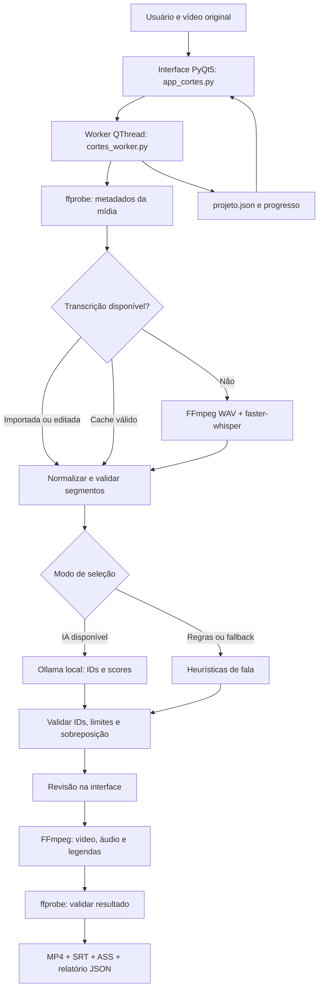

<div align="center">


# CORTZYGLOBAL
### Documentação oficial · Manual do usuário · Referência de engenharia

**DESENVOLVEDOR:** Cortzygamer &nbsp; | &nbsp; **PLATAFORMA:** Windows &nbsp; | &nbsp; **EDIÇÃO:** 18/09/2026

   

**Criatividade com controle editorial. Da transcrição ao corte pronto.**

</div>

> [!IMPORTANT]
> **Escopo da edição:** documentação da implementação inspecionada, não promessa de funcionalidades futuras. A seleção por IA usa texto transcrito, não interpretação visual dos quadros. Modelos Whisper podem precisar de download inicial. Avalie os cortes antes de publicá-los.

---

## ✦ Identidade e créditos

| Identidade | Informação |
|:--|:--|
| **Produto** | **CortzyGlobal** |
| **Desenvolvimento e autoria** | **Cortzygamer** |
| **Canal do YouTube** | **Cortzygamer** — nome informado pelo desenvolvedor; endereço do canal não verificado. |
| **Instagram** | **Cortzygamer** — nome informado pelo desenvolvedor; endereço do perfil não verificado. |
| **Ambiente-alvo** | Aplicação desktop para Windows. |
| **Propósito** | Seleção, revisão e exportação de cortes de vídeos longos com fala. |

## ✦ Guia de navegação

| Comece aqui | Aprofunde-se | Operação e suporte |
|:--|:--|:--|
| [01 · Visão geral](#1-visão-geral) | [05 · IA e transcrição](#5-como-funcionam-a-transcrição-e-a-escolha-dos-cortes) | [09 · Configurações](#9-configurações-iniciais-e-persistência) |
| [02 · Instalação](#2-requisitos-e-dependências) | [06 · Renderização](#6-renderização-legendas-integridade-e-cancelamento) | [10 · Testes](#10-testes-e-evidências-disponíveis) |
| [03 · Manual de uso](#3-manual-de-uso-do-vídeo-ao-resultado) | [07 · Arquitetura](#7-estrutura-do-projeto-e-responsabilidades-técnicas) | [11 · Problemas](#11-solução-de-problemas) |
| [04 · Modelos visuais](#4-modelos-formato-e-opções-visuais) | [08 · Dados e arquivos](#8-arquivos-de-projeto-histórico-e-exemplos-de-dados) | [12 · Limitações](#12-limites-conhecidos-e-escopo-real) |

**Manutenção e fontes:** [13 · Referências internas](#13-referências-internas-e-manutenção) · [14 · Fluxo de arquitetura](#14-diagrama-do-fluxo-e-contratos-entre-módulos) · [15 · Checklist de entrega](#15-checklist-profissional-de-operação-e-entrega).

---

## ✦ Painel executivo

| Entrada | Inteligência | Controle humano | Entrega |
|:--|:--|:--|:--|
| Vídeo local e metadados | Whisper + Ollama ou regras | Cortes, texto, horários, legenda e enquadramento | MP4, SRT, ASS, JSON e relatório |

**Fluxo do produto:** `Vídeo → ffprobe → Whisper/SRT → seleção de candidatos → validação → revisão → FFmpeg → verificação → arquivos finais`.

**Três garantias distintas:** o código verifica propriedades técnicas de saída; a integridade da fala requer revisão; qualidade editorial e desempenho em redes sociais não são garantidos por pontuação numérica.

---

## 1. Visão geral

CortzyGlobal é um aplicativo desktop de criação de cortes a partir de vídeos longos com fala, voltado a podcasts, entrevistas, lives, vídeos comentados e games. Sua proposta é transformar a gravação em sugestões de trechos **revisáveis**, permitindo que a pessoa confira a narrativa, ajuste os limites, configure a aparência e exporte arquivos individuais. O vídeo de origem não é editado nem substituído.

O fluxo é: **importar vídeo → validar mídia → obter ou importar transcrição → sugerir trechos → revisar/editar → pré-visualizar → exportar e verificar → salvar projeto e relatório**. A seleção pode utilizar Ollama local, regras textuais ou a combinação automática de ambos. Uma nota de 0 a 100 indica prioridade editorial calculada pela IA ou pelas regras; **não é uma previsão de visualizações ou viralização**.

### Recursos principais

- Aplicativo PyQt5 de tema escuro, com abertura animada nativa e identidade `logo.png`; painel lateral em abas **Vídeo**, **Estilo** e **Seleção**, área central redimensionável e abas **Cortes**, **Transcrição**, **Exportações** e **Atividade**.
- Importação de vídeo local com inspeção de duração, resolução, FPS, rotação e presença de áudio via `ffprobe`.
- Transcrição local com `faster-whisper`, detecção/seleção de idioma, VAD e tempos por palavra, além de cache reaproveitável.
- Sugestões por IA textual Ollama, regras de fala/duração ou modo automático com fallback explícito; resultados sujeitos a critérios de validade e não sobreposição.
- Edição manual de título, início e fim; criação, duplicação, exclusão e marcação dos cortes; reprodução do intervalo original.
- Importação SRT, pesquisa e edição da transcrição; prévia renderizada em 720p; exportação de vídeos finais em lote, com legendas SRT e ASS.
- Oito modelos integrados, configurações personalizáveis e modelos salvos pelo usuário; quatro proporções, três enquadramentos, quatro modalidades de legenda, texto de marca, logo e normalização de áudio.
- Projetos JSON reabríveis, salvamento automático em etapas importantes, relatórios por lote, verificação dos arquivos produzidos, logs, progresso e cancelamento.

## 2. Requisitos e dependências

| Componente | Finalidade | Observações |
|---|---|---|
| Windows | Plataforma da interface e reprodução integrada | O player depende de suporte multimídia/codecs do Windows. |
| Python 3.10 ou superior | Executar a aplicação | Ambiente virtual local `.venv`; a versão verificada no projeto usa Python 3.10. |
| PyQt5 5.15.11 | Interface, sinais, threads e multimídia | Dependência do `requirements.txt`. |
| faster-whisper 1.2.1 | Reconhecimento de fala | Usa CTranslate2; modelos podem demandar download, memória e espaço. |
| requests 2.34.2 | Comunicação HTTP com Ollama | Dependência do `requirements.txt`. |
| FFmpeg e ffprobe | Extração de áudio, inspeção e renderização | Devem estar no `PATH`; a instalação de Python não os instala. É necessário FFmpeg com suporte a `libass` para gravar as legendas. |
| Ollama + modelo | Sugestões por modelo de linguagem | Opcional no modo automático/regras; obrigatório em **Somente IA local**. Padrão: `qwen2.5:1.5b`. |

### Instalação e inicialização

1. Instale Python 3.10+ e disponibilize `python` no terminal; instale FFmpeg/ffprobe completo e configure o `PATH`.
2. Na pasta do projeto, execute `preparar_ambiente.bat`: cria `.venv` quando ausente e instala as versões definidas em `requirements.txt`.
3. Execute `iniciar.bat`: verifica `.venv\Scripts\python.exe` e inicia `app_cortes.py`. Se o ambiente não existir, ele instrui a executar o preparador.
4. Opcional para IA textual: instale Ollama separadamente e execute `ollama pull qwen2.5:1.5b`; escolha o modo desejado no aplicativo. O sistema pode iniciar o serviço Ollama já instalado, mas não instala Ollama ou o modelo automaticamente.
5. Mantenha `logo.png` na mesma pasta dos módulos Python. O logo aparece na interface e, se habilitado, nos vídeos; se ausente, a exportação prossegue sem a marca gráfica e informa isso no log.

Comandos equivalentes no PowerShell, executados a partir da raiz: `& '.venv/Scripts/python.exe' 'app_cortes.py'` para iniciar e `& '.venv/Scripts/python.exe' -m unittest discover -v` para rodar os testes. Para confirmar FFmpeg: `ffmpeg -version` e `ffprobe -version`.

## 3. Manual de uso: do vídeo ao resultado

1. Abra o aplicativo; a abertura animada pode ser pulada por **Entrar agora** quando a interface estiver pronta. Clique em **Escolher vídeo**, selecione um arquivo acessível e indique a pasta de saída em **Vídeo → Alterar pasta**.
2. Na aba **Estilo**, escolha um modelo inicial e personalize proporção, imagem, legendas, resolução, foco horizontal, texto da marca, logo e áudio. **Salvar como meu modelo** registra as preferências no usuário atual do Windows.
3. Na aba **Seleção**, defina a quantidade máxima de 1 a 50, duração mínima/máxima, modo de seleção, idioma, tamanho do Whisper e nome do modelo Ollama. O limite de duração aceito pela lógica é de 1 a 600 segundos, com mínimo menor ou igual ao máximo. A quantidade **não obriga** a produção de sugestões inválidas para preencher vagas.
4. Clique em **Analisar e sugerir cortes**. O sistema confere o vídeo, transcreve (ou reutiliza transcrição válida), avalia candidatos e apresenta sugestões sem sobreposição. Se nenhum candidato cumprir os critérios, altere os limites ou adicione cortes manuais.
5. Em **Cortes**, revise título, início, fim, duração, nota e texto do trecho. Edite título e horários diretamente na tabela; use segundos, vírgula decimal ou `hh:mm:ss`. **+ Corte manual**, **Duplicar**, **Remover**, **Marcar todos** e **Desmarcar** ajudam a montar a lista.
6. Selecione um corte e use **Assistir corte** ou duplo clique na miniatura para tocar apenas o intervalo no player interno. **Posição → início/fim** utiliza o ponto atual do vídeo original; **Repetir corte** repete o intervalo. Volume, silenciamento e velocidade de 0,5× a 2× afetam somente a reprodução, não o arquivo exportado.
7. Em **Transcrição**, pesquise, corrija falas e horários ou clique em **Importar SRT**. Ao editar uma fala, a sincronização por palavra daquele segmento deixa de ser válida; a legenda passa a usar o intervalo do trecho. Confira nomes próprios, números e finais de frases.
8. Use **Prévia com modelo** para renderizar apenas o corte escolhido em 720p, já com enquadramento, legendas e marca. A prévia original é rápida, mas não representa fielmente o efeito final: use a prévia renderizada para validar a aparência.
9. Marque os cortes desejados e pressione **Exportar selecionados**. O sistema renderiza cada item e o verifica. Veja os registros em **Exportações**; duplo clique abre o MP4, e há comandos para abrir SRT, assistir arquivo e abrir a pasta.
10. Use **Salvar projeto** (`Ctrl+S`) para escolher um destino e **Abrir projeto** (`Ctrl+O`) para retomar a edição. Preserve o vídeo original: o JSON do projeto referencia o arquivo de origem, mas não incorpora o próprio vídeo.

**Ajuda e diagnóstico:** `F1` abre a central de ajuda com busca; o menu **Ajuda → Verificar ferramentas** registra informações de ambiente na aba Atividade; **Sobre o CortzyGlobal** mostra créditos. A área inferior apresenta progresso, status e botão **Cancelar**. Durante tarefas em andamento, comandos incompatíveis ficam bloqueados.

## 4. Modelos, formato e opções visuais

| Modelo incorporado | Formato inicial | Composição e aplicação |
|---|---|---|
| Podcast vertical | 9:16 | Imagem completa diante de fundo desfocado; preserva participantes. |
| Entrevista completa | 4:5 | Quadro inteiro com margens; útil para várias pessoas. |
| Games • tela preservada | 9:16 | Gameplay inteiro sobre fundo e legendas fortes; a seleção considera fala, não gameplay visual. |
| Live e entretenimento | 9:16 | Contexto mais longo e legendas fortes. |
| Palavra em destaque | 9:16 | Destaque temporal por palavra quando há tempos reais disponíveis. |
| Retrato com foco ajustável | 9:16 | Preenchimento com recorte e posição horizontal manual. |
| Feed quadrado | 1:1 | Imagem completa com margens. |
| YouTube horizontal | 16:9 | Imagem preservada para vídeos horizontais. |

As proporções aceitas são `9:16`, `1:1`, `4:5` e `16:9`. Em 720p, as dimensões base são, respectivamente, **720×1280**, **720×720**, **720×900** e **1280×720**; a qualidade 1080p multiplica cada dimensão por 1,5. A prévia renderizada força qualidade 720p. A composição `fit` preserva a imagem inteira com margens pretas, `blur` preserva a imagem inteira sobre fundo preenchido/desfocado, e `crop` preenche o quadro mediante recorte. `focus_x` entre 0 e 1 desloca o recorte horizontalmente, sem acompanhar automaticamente o assunto.

As legendas podem ser `clean` (claras), `bold` (destaque), `karaoke` (destaque de palavras com tempos reais) ou `none` (sem legenda gravada no vídeo). O sistema gera os arquivos de legenda SRT e ASS mesmo quando a legenda não é gravada; o texto da marca pode ser gravado pelo filtro ASS de modo independente. `show_logo` governa a imagem gráfica sobreposta e `brand` é a marca textual. `normalize_audio` aplica o filtro FFmpeg `loudnorm` com alvo de -16 LUFS, pico verdadeiro -1,5 dBTP e LRA 11 quando há áudio. A exportação usa H.264 (`libx264`, preset `fast`, CRF 20), pixel format `yuv420p`, áudio AAC a 192 kb/s e `+faststart`.

## 5. Como funcionam a transcrição e a escolha dos cortes

**Pré-validação:** `probe_media()` usa ffprobe para identificar faixa de vídeo, dimensões de exibição considerando rotação, FPS, duração e existência de áudio. Um vídeo sem faixa de áudio não pode ser transcrito automaticamente: importe SRT ou adicione cortes manuais. A transcrição é executada em subprocesso independente: FFmpeg extrai a primeira faixa de áudio em WAV PCM mono de 16 kHz e `faster-whisper` processa na CPU em `int8`, com `word_timestamps=True`, filtro de atividade de voz (`vad_filter=True`) e `beam_size=5`.

**Cache:** a pasta `.cache_transcricoes` armazena JSON por assinatura SHA-256 de caminho do vídeo, tamanho, data de modificação em nanossegundos, idioma, modelo e versão do esquema. Um cache válido evita transcrever novamente; **Refazer transcrição ao analisar** ignora o cache e o texto revisado. A impressão digital do arquivo não calcula seu hash integral: alterações que preservem tamanho e data podem não ser identificadas. Modelos `tiny`, `base`, `small`, `medium` e `large-v3` são aceitos pela validação interna; o seletor gráfico expõe tiny, base, small e medium. O padrão é base e idioma português.

**Tratamento de segmentos:** a transcrição é normalizada e validada; quando existem tempos por palavra, frases podem ser divididas na pontuação, preservando os limites medidos. O texto é particionado em janelas de até aproximadamente 6.500 caracteres, com sobreposição temporal para manter contexto nas fronteiras dos vídeos longos. Os IDs dos segmentos são identificadores reais dentro dessas janelas.

**Modo Somente IA local:** o worker consulta `http://localhost:11434/api/tags`, verifica o modelo solicitado e, se necessário, tenta iniciar uma instalação existente de Ollama. Chama `/api/generate` com esquema JSON estruturado contendo `inicio_id`, `fim_id`, `titulo` e `score`. O modelo avalia **a transcrição textual**, não os pixels. Os IDs retornados precisam existir e estar em ordem; o aplicativo obtém os tempos dos segmentos reais, rejeita duração inválida, títulos não presentes literalmente na fala são substituídos pelo começo do trecho, e uma margem de até 0,12 segundo pode preservar limites sem exceder a duração máxima. Pontuação e justificativa são auxiliares editoriais.

**Modo Regras de fala e duração:** dispensa Ollama; produz candidatos usando duração, densidade de fala, finalização por pontuação, contexto de abertura e termos/expressões de interesse. A origem é identificada como `heuristic`. **Automático:** tenta Ollama quando disponível e recorre às regras caso indisponível ou sem sugestões válidas, informando a mudança no log e na análise. Em modo exclusivamente IA, indisponibilidade do Ollama gera erro em vez de fallback silencioso.

**Validação final e ranking:** `validate_clip()` confere `0 ≤ início < fim ≤ duração do vídeo`, normaliza título, seleção e nota. `rank_candidates()` remove durações fora dos limites, ordena os demais por nota decrescente e início, descarta sobreposições e respeita `max_clips`. Menos cortes válidos que o máximo configurado é comportamento esperado. Revisão editorial humana continua obrigatória para sentido, ritmo, começo/fim da fala e enquadramento.

## 6. Renderização, legendas, integridade e cancelamento

`cortes_media.render_clip()` recebe vídeo, intervalo, segmentos, configurações, diretório, índice e callback de cancelamento. Antes da renderização, confirma limites e exige pelo menos um quadro. Cria uma pasta temporária exclusiva, gera `captions.srt` com texto e tempos relativos ao início do corte, e `captions.ass` com estilos e eventos para incorporação visual pelo filtro `ass`. Os tempos por palavra são usados somente quando disponíveis; arquivos SRT importados e falas editadas usam blocos por segmento — não há alinhamento inventado. Conteúdo de texto é escapado para não executar comandos ASS provenientes da transcrição ou da marca.

FFmpeg busca o instante inicial no vídeo original com `-ss`/`-accurate_seek`, limita o intervalo com `-t`, realiza escala e enquadramento, aplica as legendas e marca de texto quando cabível e sobrepõe `logo.png` se habilitado. O áudio é incluído se existir, com normalização opcional. A saída intermediária é `clip.mp4`. Em seguida, ffprobe compara duração com tolerância de grade de quadros, resolução e presença de áudio; só então a pasta temporária é **renomeada/publicada** como pasta final exclusiva. Esse procedimento evita apresentar um vídeo incompleto como resultado final.

Cada exportação recebe pasta e nome únicos; reexportações não sobrescrevem saídas antigas. Em lote, falha de um item é registrada, os demais são tentados, e o relatório registra erros. O cancelamento requisita interrupção ao worker, encerra subprocessos ativos e preserva itens já finalizados. A prévia usa o mesmo caminho de renderização em 720p, mas aparece no histórico como `preview=true` e não entra no contador de exportações finais. A duração efetiva pode diferir ligeiramente do intervalo pedido em razão da grade de quadros; a tolerância de validação considera essa característica.

## 7. Estrutura do projeto e responsabilidades técnicas

```text
cortes automaticos 1.0/
├── app_cortes.py               # Interface PyQt5, player, formulários e revisão
├── cortes_core.py              # Modelos, validação, heurísticas, SRT e projeto JSON
├── cortes_worker.py            # QThread: transcrição, Ollama, exportação e cancelamento
├── cortes_media.py             # ffprobe, FFmpeg, composição, legendas e validação
├── requirements.txt            # Bibliotecas Python com versões fixadas
├── iniciar.bat                 # Inicialização pelo ambiente virtual
├── preparar_ambiente.bat       # Preparação/reinstalação de bibliotecas Python
├── logo.png                    # Identidade gráfica e sobreposição opcional
├── README.md                   # Manual existente e orientações de uso
├── PESQUISA_E_RECURSOS.md      # Pesquisa e critérios, distinguindo expectativas de entregas
├── test_app_cortes.py          # Testes de lógica, interface e worker
├── test_cortes_media.py        # Testes de integração da mídia/FFmpeg
├── .cache_transcricoes/        # Cache local de reconhecimento de fala
├── cortes_prontos/             # Projetos, prévias e lotes exportados
├── .verification/              # Fixtures, scripts, imagens e evidências de verificação
├── .venv/                      # Ambiente Python ativo; não é código de produto
└── .venv_backup_*/             # Cópia anterior de ambiente; não é código de produto
```

**Arquitetura:** `app_cortes.py` constrói a janela e recebe ações; `cortes_worker.py` executa trabalho pesado em `QThread` e em subprocessos, emitindo sinais `log_signal`, `progress_signal`, `project_signal` e `finished_signal`; `cortes_core.py` mantém regras e persistência independentes da interface; `cortes_media.py` executa operações de mídia e valida seus resultados. A interface recebe atualizações do worker por sinais, evitando processar transcrição/renderização diretamente no fluxo visual. Não há servidor web próprio ou serviço de nuvem para o projeto; a conexão HTTP com Ollama ocorre em localhost.

**Funções de referência:** `validate_settings`, `validate_clip`, `normalize_segments`, `sentence_segments`, `transcript_windows`, `rank_candidates`, `clip_from_ids`, `heuristic_candidates`, `save_project`, `load_project`, `import_srt` (núcleo); `WorkerCortes.analyze`, `transcrever_isolado`, `ollama_available`, `analisar_llm`, `export` (orquestração); `probe_media`, `_caption_cues`, `_write_subtitles`, `_video_filter`, `render_clip`, `preview_clip` (mídia). A classe principal de janela chama-se `MiniCortesApp`; há também `StartupScreen` e `ThumbnailWorker`.

## 8. Arquivos de projeto, histórico e exemplos de dados

Ao analisar, o sistema cria `cortes_prontos/projeto_<identificador>/projeto.json` ou a estrutura correspondente na pasta de saída escolhida. O documento inclui `version: 1`, `source` (caminho do vídeo original), `source_fingerprint` (tamanho e modificação), `media`, `settings`, `segments`, `clips`, `exports`, `analysis` e `project_path`. A gravação por `save_project()` utiliza arquivo temporário, sincronização em disco e substituição atômica. `load_project()` exige esquema versão 1, valida dados, converte origem relativa em absoluta e limita o JSON a 100 MB. A pasta do arquivo original precisa permanecer acessível.

Campos principais de um segmento: `id`, `start`, `end`, `text` e `words` (cada palavra inclui `start`, `end`, `word`). Um corte possui `titulo`, `inicio`, `fim`, `score`, `motivo`, `selected`, podendo incluir `origem`, `descricao`, IDs de fala e justificativa. O histórico de exportações registra caminhos, duração/dimensões verificadas, intervalo original, formato, enquadramento, estilo de legenda, quantidade de legendas e aplicação da logo.

```text
cortes_prontos/
├── projeto_XXXXXXXX/projeto.json
├── previa_XXXXXXXX/
│   ├── 01_Titulo_identificador/clip.mp4
│   ├── 01_Titulo_identificador/captions.srt
│   ├── 01_Titulo_identificador/captions.ass
│   └── relatorio.json
└── exportacao_XXXXXXXX/
    ├── 01_Titulo_identificador/{clip.mp4,captions.srt,captions.ass}
    ├── 02_Outro_titulo_identificador/{clip.mp4,captions.srt,captions.ass}
    └── relatorio.json
```

Os nomes acima são esquemáticos: o identificador e o slug real dependem da execução. `relatorio.json` contém a origem, a lista de cortes solicitados, as configurações, os resultados daquele lote e a lista de erros. `projeto.json` serve à retomada do trabalho; os MP4 são os vídeos finais e SRT/ASS são arquivos auxiliares de legenda. Projetos e legendas podem conter a fala transcrita, portanto merecem o mesmo cuidado de privacidade que o material original. Prévias, exportações e caches ocupam disco e não constituem backup remoto.

## 9. Configurações iniciais e persistência

| Chave | Padrão | Significado |
|---|---|---|
| `template` | `podcast` | Modelo inicial. |
| `min_duration` / `max_duration` | `20.0` / `60.0` | Intervalo permitido por sugestão, em segundos. |
| `max_clips` | `5` | Número máximo de candidatos sem sobreposição (1–50). |
| `language` / `whisper_model` | `pt` / `base` | Idioma e tamanho do reconhecimento. |
| `ollama_model` / `selection_mode` | `qwen2.5:1.5b` / `auto` | Modelo e política IA/regras. |
| `format` / `framing` / `captions` | `9:16` / `blur` / `clean` | Formato e estilo visual. |
| `quality` / `normalize_audio` | `1080p` / `true` | Saída final e controle de volume. |
| `brand` / `show_logo` | texto vazio / `true` | Marca textual e imagem gráfica. |
| `focus_x` | `0.5` | Posição horizontal fixa de recorte. |
| `output_dir` | pasta `cortes_prontos` do projeto | Destino padrão de trabalho. |
| `auto_export` | `false` | Quando ativado, exporta após a análise sem revisão. |

As configurações são verificadas contra valores permitidos; duração, quantidade, foco e formato inválidos provocam erro compreensível. A interface utiliza preferências do usuário via `QSettings` e pode migrar modelos/configurações de uma versão anterior preservando os dados antigos. O programa salva projetos automaticamente após análise, cada exportação concluída, troca de vídeo e fechamento, além do salvamento manual em arquivo escolhido. O seletor de quantidade rápida ajusta a próxima análise; não exclui cortes já criados.

## 10. Testes e evidências disponíveis

A suíte `test_app_cortes.py` testa seleção por IDs existentes, ordenação global, ausência de sobreposição, duração/quantidade, janelas da transcrição, limites, configurações, projetos, SRT, fallback da IA, erros, cancelamento e edição na interface. `test_cortes_media.py` testa FFmpeg real, corte próximo a transições, áudio, legendas relativas, proporções, enquadramentos, vídeo sem áudio, caminhos especiais e não publicação de saída parcial. Para executar todos: `& '.venv/Scripts/python.exe' -m unittest discover -v` na raiz do projeto. **Este documento não afirma que uma execução nova desses testes foi realizada durante sua elaboração.**

A pasta `.verification` contém scripts e artefatos existentes para testes de transcrição real (`verificar_transcricao_real.py`), pipeline (`verificar_pipeline.py`), painel (`verificar_painel.py`), branding e mudança de cortes, além de vídeos, transcrições, relatórios e capturas. O arquivo `PESQUISA_E_RECURSOS.md` registra **16 testes aprovados numa verificação anterior**, experimentos com fala sintetizada e avaliações de integração; esses resultados são históricos, dependem do ambiente e não substituem testes atuais com mídia real do usuário. Uma mídia sintética limpa não mede qualidade editorial em vídeos com ruído, sotaques ou vozes sobrepostas.

## 11. Solução de problemas

| Sintoma | Verificação e ação |
|---|---|
| `iniciar.bat` informa ambiente ausente | Execute `preparar_ambiente.bat`, confira Python no PATH e instalação das dependências. |
| FFmpeg/ffprobe não encontrado | Instale FFmpeg completo, ajuste PATH, reinicie o terminal e confirme os comandos `ffmpeg -version` e `ffprobe -version`. |
| Erro ao gravar legendas | Confira se a distribuição FFmpeg inclui o filtro `ass`/`libass` (`ffmpeg -filters`) e se há permissão de gravação. |
| Ollama ausente ou modelo não encontrado | Instale/execute Ollama e baixe o modelo selecionado; alternativamente, escolha Automático ou Regras. |
| Whisper lento ou insuficiência de recursos | Escolha `tiny` ou `base`, libere recursos e reduza o vídeo; modelos maiores demandam mais CPU, RAM e disco. |
| Primeira transcrição exige conexão | O modelo Whisper selecionado precisa estar no cache; a primeira obtenção pode baixar arquivos. |
| Nenhum corte sugerido | Confira presença de fala/SRT, idioma, duração mínima/máxima e log; use cortes manuais se necessário. |
| Título inadequado ou frase incompleta | Revise texto, começo/fim, ou ajuste a transcrição; a IA não garante decisão editorial correta. |
| Destaque por palavra não funciona após edição/SRT | Tempos por palavra não existem ou foram invalidados; a legenda usa o segmento inteiro. |
| Player interno não abre o vídeo | Verifique codecs do Windows; use **Player externo** e prévia renderizada. A prévia original externa abre o vídeo inteiro. |
| Projeto reaberto sem vídeo | Restaure o arquivo de origem no caminho esperado; o JSON não embute a mídia. |
| Projeto avisa que vídeo mudou | Reanalise/refaça transcrição do arquivo atual antes de exportar. |
| Renderização interrompida | Confira aba Atividade e `relatorio.json`; arquivos completos são preservados, temporários não devem ser considerados finais. |
| Marca gráfica ausente | Mantenha `logo.png` na pasta do código e ative **Logo nos cortes e prévias**. |

## 12. Limites conhecidos e escopo real

- A seleção automática avalia **texto e duração**, não cenas, emoções faciais, kills, vitórias, expressões ou mudanças visuais. Não há análise multimodal do vídeo nem rastreamento automático de rostos.
- O recorte com foco é **horizontal e fixo**; ele não segue pessoas que se movem. Confira a prévia se há mais de um participante ou elementos importantes nas bordas.
- Reconhecimento de fala e modelos de linguagem podem errar palavras, nomes, contexto, início/fim e títulos. O processo não garante desempenho em redes sociais, qualidade narrativa ou viralização.
- Não há publicação ou agendamento automático em redes, B-roll gerado automaticamente, dublagem, colaboração em nuvem ou equivalência integral a plataformas comerciais pesquisadas.
- A operação pode ocorrer localmente após instalar os programas e obter os modelos; downloads iniciais do Whisper e instalação manual de Ollama podem exigir internet. O endpoint Ollama usado pela aplicação é local (`localhost:11434`).
- A exportação depende dos codecs/filtros do FFmpeg, da disponibilidade do original, dos recursos da máquina e da permissão de escrita. A reprodução interna depende ainda do Windows.

## 13. Referências internas e manutenção

Consulte `README.md` para a operação de interface e atalhos; `PESQUISA_E_RECURSOS.md` para metodologia e evidências históricas; `requirements.txt` para dependências exatas; arquivos `test_*.py` e `.verification/` para critérios de teste. Para mudanças de comportamento, altere as regras em `cortes_core.py`, orquestração em `cortes_worker.py`, geração de mídia em `cortes_media.py` e interface em `app_cortes.py`, rodando os testes após a alteração. Evite editar `.venv`, caches, exportações ou registros de verificação como se fossem código-fonte. Guarde backup do vídeo original, projetos JSON e resultados finais antes de limpar pastas geradas.


## 14. Diagrama do fluxo e contratos entre módulos



**Fronteiras de responsabilidade.** A interface coordena a experiência; o núcleo valida valores e persiste dados; o worker gerencia etapas e cancelamento; o módulo de mídia renderiza e inspeciona a saída. O Ollama funciona em `localhost:11434`, e modelos Whisper são executados localmente após disponibilizados.

### Contratos de dados

| Contrato | Campos centrais | Responsável |
|:--|:--|:--|
| Entrada de vídeo | Caminho, duração, dimensões, FPS e áudio | `probe_media` |
| Segmento da fala | `id`, `start`, `end`, `text`, `words` | `normalize_segments` |
| Sugestão de corte | `titulo`, `inicio`, `fim`, `score`, `selected`, `origem` | `clip_from_ids` / `heuristic_candidates` |
| Projeto reabrível | `version`, `source`, `settings`, `segments`, `clips`, `exports` | `save_project` / `load_project` |
| Exportação verificada | Caminhos MP4/SRT/ASS, dimensões e duração medidas | `render_clip` |

> [!NOTE]
> Os diagramas Mermaid dependem do visualizador Markdown. Em editores sem suporte, a descrição textual deste capítulo continua sendo a referência. A capa SVG usa um arquivo local do projeto; mantenha `docs_banner.svg` ao lado deste documento para preservar as cores.

## 15. Checklist profissional de operação e entrega

- [ ] **Ambiente:** Python, FFmpeg/ffprobe e bibliotecas disponíveis; Ollama instalado e modelo baixado apenas quando desejado.
- [ ] **Fonte:** vídeo original íntegro, acessível e com áudio; caso contrário, usar SRT ou edição manual.
- [ ] **Seleção:** conferir se cada título, início, fim e quantidade corresponde aos limites definidos.
- [ ] **Conteúdo:** revisar começo da fala, contexto, conclusão, nomes e texto das legendas.
- [ ] **Visual:** renderizar prévia com modelo, verificar enquadramento, cortes laterais, marca e legibilidade.
- [ ] **Exportação:** conferir MP4, SRT, ASS, duração, resolução, áudio, `relatorio.json` e aba Atividade.
- [ ] **Retomada:** conservar `projeto.json` e original; fazer backup dos resultados e não confundir cache com backup.
- [ ] **Evolução:** rodar `& '.venv/Scripts/python.exe' -m unittest discover -v` depois de alterar código; documentar qualquer falha.

---

<div align="center">

**CORTZYGLOBAL** · Documentação técnica e funcional

**Desenvolvido por Cortzygamer** · **YouTube: Cortzygamer** · **Instagram: Cortzygamer**

*Seu conteúdo. Novos formatos. Controle em cada corte.*

</div>
